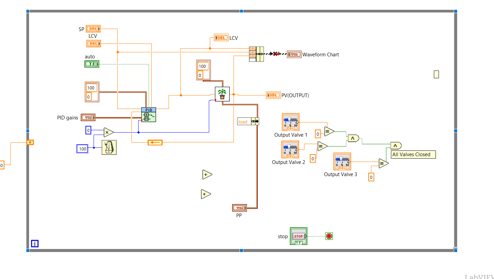
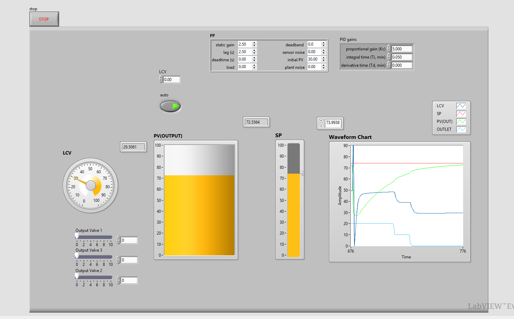

# Water Level Control System - LabVIEW PID Simulation

A **closed-loop water-level control system** implemented in **LabVIEW** using PID control. The project demonstrates setpoint tracking, process feedback, controller tuning, simulated plant behavior, and real-time response visualization.

## Control Architecture

<p align="center">
  
</p>

## Working Simulation

<p align="center">
  
</p>

## Control Flow

```text
Setpoint -> PID Controller -> Plant / Water-Level Process -> Process Value
              ^                                      |
              |--------------- Feedback -------------|
```

## Main Elements

- Setpoint (SP)
- Process value / level feedback (PV)
- PID gain controls
- Automatic control selection
- Plant/process simulation
- Waveform response chart
- Output-valve indication

## Repository Structure

```text
water-level-control-labview/
├── labview/
├── assets/
├── docs/
└── README.md
```

## Opening the Project

1. Open `labview/rasmy.lvproj` in LabVIEW.
2. Open `rasmy.vi`.
3. Relink any missing PID/plant subVI if requested.
4. Run the VI and adjust the setpoint and PID parameters.

## Dependency Note

The original local project referenced a PID/plant example VI from a machine-specific LabVIEW location. That local path was intentionally removed. If LabVIEW requests the missing VI, relink it to the equivalent control/PID VI installed in your environment or replace it with your local plant model.

User-specific LabVIEW state files are excluded from Git.

## Skills Demonstrated

LabVIEW, PID control, feedback systems, process control, simulation, setpoint tracking, and control-system visualization.

---

**Author:** Mohamed Rasmy  
**Project type:** Control Systems / LabVIEW Simulation
